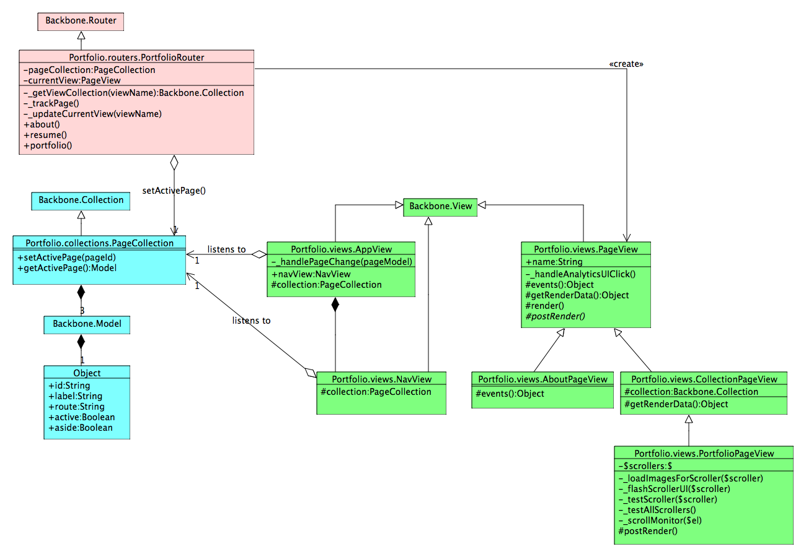

# Portfolio
This is the source project for my portfolio app, hosted at [engineer.moonb.us](http://engineer.moonb.us). This app in itself serves  as a good example of many techniques I have used on recent professional projects. It's free to be used as the basis for a similar site of one's own, although I haven't spent a lot of effort beyond good organization of styles and such to promote themability or ease of customization.
## Installation
Portfolio uses a Grunt based build, so you'll need to install Node and Grunt first if you haven't already. Then, from within the project directory after cloning this from github, on the CLI run:

1. `npm install` — to install Grunt build dependencies
2. `bower install` — to install application build dependencies
3. `grunt serve:dist` — to build and serve the app via localhost:9000

## Technologies Used
A lot goes into the mix of developing a modern webapp. This isn't an exhaustive (or recursive :wink:) list, but provides an overview of the more significant technologies used:

* [Yeoman](http://yeoman.io/) with a [Backbone generator](https://github.com/yeoman/generator-backbone) for the initial project scaffolding.
* [Grunt](http://gruntjs.com/) for building the project.
* [Bower](http://bower.io/) for application library dependency management.
* [SASS](http://sass-lang.com/) with [Compass](http://compass-style.org/install/) for syntatic styling goodness.
* [jQuery](http://jquery.com/) of course.
* [Backbone.js](http://backbonejs.org/) for the MVC framework.
* [LinkedIn's fork of Dust](https://github.com/linkedin/dustjs) for dynamic HTML templating.
* [digi-grid](https://github.com/digitaljhelms/digi-grid) for a SASS based grid system.
* My own [wrscroller](https://github.com/wruth/wrscroller) for a simple jQuery based content scroller.
* [grunt-ver](https://github.com/chrisdanford/grunt-ver) for cache busting loaded resources in the distribution build.
* [76design Social Icons](https://github.com/76design/76d-social-icons) for a nice SASS and font based social icon set.

## Application Design
The architecture of the app is pretty simple. This diagram shows the major classes and relationships:

There's a bit of an inheritence hiearchy in the view classes, but that is in the interests of keeping things DRY. Here's an outline of the main roles and responsibilities of some of these classes:

* **`PageCollection`:**  This collection maintains the logical state of the app, and is effectively it's model. It has three model instances representing the three pages of the app. It is used directly by the `NavView` to render the nav menu items. The `PortfolioRouter` will call it to update the current page, and the `NavView` listens for these updates in order to keep the selected state rendering of it's nav items up to date. The `AppView` also listens for these updates to keep the rendering of the background in sync with the current page.
* **`PortfolioRotuer`:**  No suprise, as in most Backbone apps the router kind've runs the show, managing removing and creating the appropriate view for each of it's three routes. Additional responsibilities when a route changes include:
	* Calling `setActivePage(viewName)` on the `PageCollection` instance it has a reference to.
	* If the view requires a collection, ensure this is created and kick off a `fetch` on it if necessary. Also cache a reference to the collection in the corresponding page model for the route so this only happens once per route invocation.
	* Track the pageview for Google Analytics.
* **`PageView`:**  Effectively the abstract base class for the page based views. Requires a `name` property, which it uses to add a CSS class of that name to it's element, as well as to resolve the dust template to use to render the view. Provides some rendering hooks for subclasses to use, and general click event Google Analytics tracking for UI elements.
* **`CollectionPageView`:**  Extends `PageView` to add support for rendering a `Backbone.Collection`.
* **`PortfolioPageView`:** Extends `CollectionPageView` to add support for managing lazy image loading and display behaviors for it's project example content scrollers.

## License
Copyright (c) 2014 Ward Ruth

Licensed under the MIT License